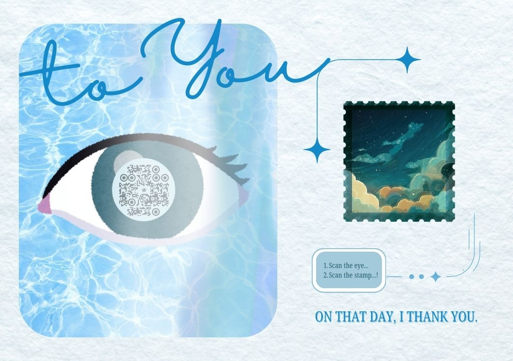

# LoreSight: Bridging Art and Narrative

## Introduction

**LoreSight** is an innovative project designed to create a seamless bridge between physical art and digital storytelling. It transforms static illustrations into gateways to rich, interactive narratives, offering a unique way to experience stories embedded within visual media.

## What is LoreSight?

LoreSight is currently in active development, running in parallel with The Train of Thoughts v2. Its core concept is to allow users to scan physical illustrations and be redirected to corresponding digital content, enriching the visual experience with narrative depth.

## Current Features (Demo)

- **Augmented Reality (AR.js):** LoreSight currently utilizes AR.js to recognize custom illustrations as markers. When a user scans one of these designated illustrations with their device, the application triggers a redirection.
- **Illustration-Triggered Redirection:** Each recognized illustration marker acts as a unique key, guiding the user to a specific digital narrative or experience online.

## Future Vision

LoreSight is continuously evolving, with ambitious plans for future enhancements:

- **Optical Character Recognition (OCR) Integration:** A key future development involves integrating OCR capabilities. This will enable LoreSight to detect unique ticket numbers or other textual elements from physical markers, directing users to highly personalized journeys within a narrative.
- **Advanced Computer Vision (CV):** Beyond OCR, future iterations will leverage more advanced Computer Vision techniques to enhance marker recognition, enable more complex interactions, and potentially interpret broader visual cues within illustrations.
- **Personalized Storytelling:** The ultimate goal is to create bespoke digital adventures, where each user's interaction with a physical marker leads them down a unique narrative path, deeply integrated with projects like The Train of Thoughts v2.

## Connection to The Train of Thoughts v2

LoreSight is an integral component of The Train of Thoughts v2. It serves as the interactive mechanism that allows participants to engage with the narrative journey. By scanning specific illustrations (or eventually, tickets), users will embark on their personalized segment of the Train of Thoughts experience.

## Getting Started (Demo)

To experience the current demo of LoreSight:

1.  Ensure you have the demo application running on your device.
2.  Scan the stamp of the 'Weaving Eye' card (see attached image for reference).
3.  Observe as LoreSight recognizes the marker and redirects you to its associated digital narrative.

